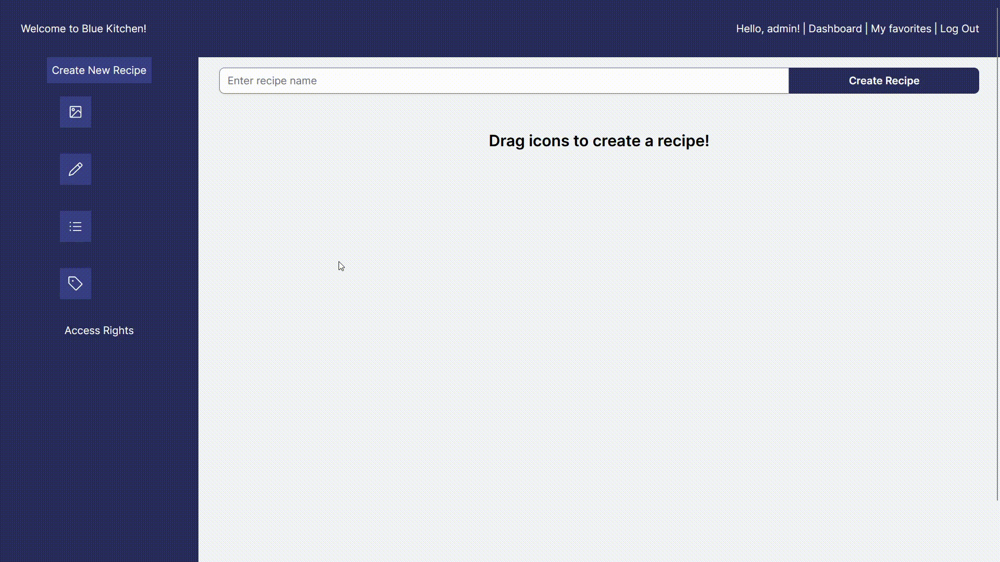
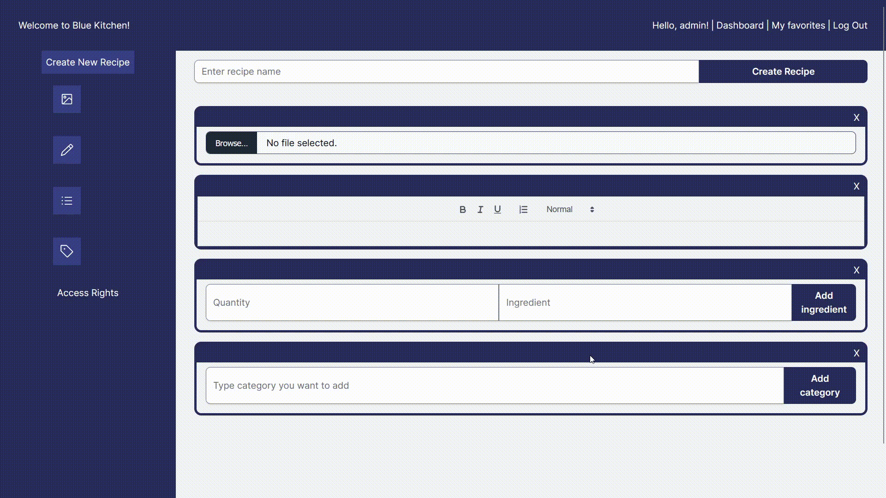

# WD-3.4 Full-stack Capstone Project

This is implementation of Turing College Web Development project for Module 3 Sprint 4.

## Table of Contents

- [Setup](#setup)
- [Tests](#tests)
- [Test coverage](#test-coverage)
- [Running the server](#running-the-server)
- [Running the client](#running-the-client)
- [Live version](#live-version)

## Setup

1. Clone this repository:

```sh
 git clone git@github.com:krinkevicius/drag-and-drop.git
```

2. Navigate to the project directory:

```sh
 cd drag-and-drop
```

3. Install dependencies:

```sh
npm install
```

4. Setup `.env` files in `server` and `client` based on respective `.env.example` files.

In order to upload images, you will need to setup aws S3 bucket. A good tutorial on how to setup one is here https://www.youtube.com/watch?v=yGYeYJpRWPM (4:10 - 10:55)

5. Create initial admin user and recipe by running migrations:

```sh
cd server
npm run migration:run
```

Currently this is the only way to create an admin user which can create new recipes.

## Tests

### Server

```bash
# runs tests against an in-memory pg-mem database
npm run test

# runs tests with the configured database
npm run test:db
```

<b>Important!</b> pg-mem does not fully support functionality used in this project. If you choose to run tests in-memory, some of them will be skipped.

### Test coverage

```bash
# coverage is ran against an in-memory database
npm run coverage

# or against real database
npm run coverage:db
```

<b>Important!</b> Running coverage against real database will cover more code and provide more accurate picture.

### Client

```bash
# runs unit tests
npm run test:unit

# runs E2E tests
npm run test:e2e:chromium
```

## Running the server

In development mode:

```bash
# automatically restarts the server
npm run dev

# uses in-memory pg-mem database
npm run dev:mem
```

## Running the client

```sh
cd client
npm npm run dev
```

If you ran migrations, you should be able to login as admin user with the credentials you set up in server `env` file.
Afterwards, you will be redirected to the dashboard. There you can drag icons from the side bar to add ingredients, images, descriptions or categories.



You can also drag items around if you want change their order.



You can also signup with regular user.

- As a visitor I can sign up;
- As a visitor I can login as a registered user;
- As a visitor I can browse recipes;
- As a user I can comment on recipes;
- As an admin user I can create new recipes;
- As an admin user I can update the access of other users;
- As a user I can add or remove a recipe to/from my favorites;
- As a user I can view my favorites;

## Live version

Live version is hosted here (more recipies comming soon!):

https://blue-kitchen.l6jprqq8fc77i.eu-central-1.cs.amazonlightsail.com/
